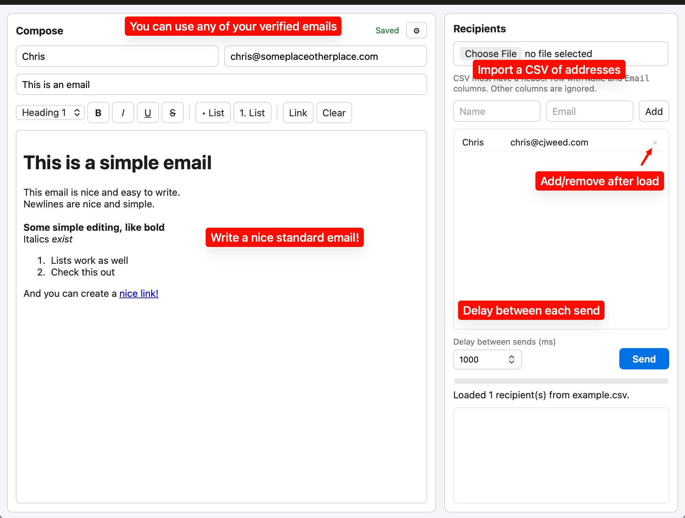

# Bulk Mailer (Simple Mail Merge)

A tiny macOS app for sending personalized bulk email through your own
iCloud SMTP account. Write one email, load a CSV of recipients, hit send.



## Features

- Rich text compose (bold, italic, underline, lists, links) with
  keyboard shortcuts — `⌘B` `⌘I` `⌘U` `⌘K`
- Send from any verified address on your iCloud account
- CSV import (`Name,Email` header) plus manual add/remove of recipients
- Configurable delay between sends, live progress and error log
- Everything persists locally — credentials, draft, and recipient list
  are restored next launch
- Signed and notarized macOS builds

## Download

Grab the latest `.dmg` from
[GitHub Releases](https://github.com/Kikketer/Simple-Mail-Merge/releases).

## Usage

1. Create an app-specific password at
   [appleid.apple.com](https://appleid.apple.com)
2. Open Settings (⚙) and enter your iCloud email + app password, verify
3. Pick your From name and any verified From address
4. Write your email, load `example.csv` or your own `Name,Email` CSV
5. Send

## Support

This is a **"Fork it, Fix it yourself"** app. Agents write all the code
anyway, so do what you want — fork it, file issues, send PRs, or take
the code and run.

## Development

```bash
bun install
bun run dev      # watch-mode dev build
bun run build    # stable build
bun run release vX.Y.Z  # signed + notarized + GitHub release (needs release.env)
```

Built with [electrobun](https://electrobun.dev) + nodemailer.
